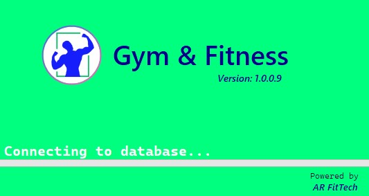
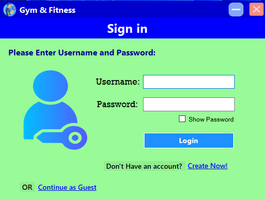
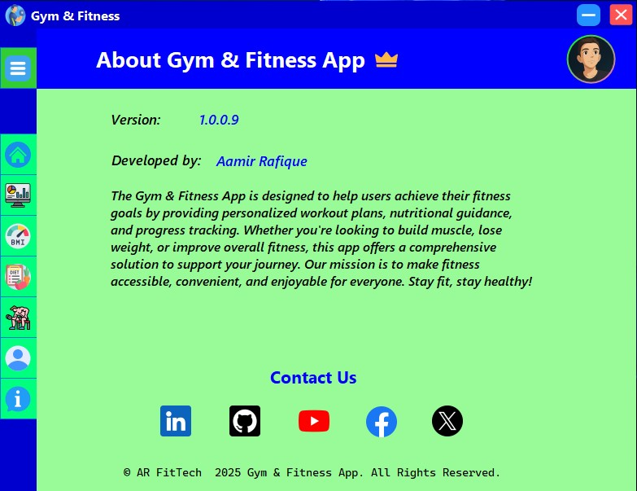

# 🚀 Gym And Fitness Application

## 📌 Overview

The **Gym And Fitness Application** is a Full-stack WinForms **C#** fitness application designed to assist users in achieving their health and workout goals. It provides personalized workout plans, nutritional guidance, and progress tracking. Whether you're aiming to build muscle, lose weight, or enhance overall fitness, this application offers a structured approach to support your journey. Our mission is to make fitness accessible, convenient, and enjoyable for everyone. Stay fit, stay healthy!


---

## 🎯 Features
- Used OOP concepts (Encapsulation, inheritance etc.)
- **User Authentication**: Secure login/signup implementation using the **Singleton** design pattern.
- **User-Friendly Interface**: Designed using **Windows Forms (WinForms)** for easy navigation and interaction.
- **BMI Calculator Module**: Users can calculate their Body Mass Index.
- **Personal Profile**: To maintain a proper fitness profile.
- **Workout Module**: Users can access pre-defined workout routines or create their own custom plans.
- **Nutrition Tracking**: A built-in system to search for meals and track calorie intake.
- **Diet Plans (Customizable)**: Suggested meal recipes based on fitness goals + customized meal scheduling for breakfast, lunch, dinner, snacks, etc.
- **Water Intake Tracking**: A feature to track daily water intake.
- **Fitness Progress Monitoring**: Users can track their progress through visual analytics and reports.
- **Workout Guides**: Comprehensive workout guides categorized by exercise type.
- **Customized Workout Plans**: Personalized workout plans for structured exercise tracking.
- **Challenges Section & Motivational Quotes**: To keep users motivated throughout their fitness journey.
- **SQL Database Integration**: Secure **storage and retrieval** of user data, including fitness progress, workouts, and nutrition records.
- **Email Verification for Premium Users**: Secure **Premium membership** for extra features with improved user experience.


---

## 🏗️ Technology Stack

### ✅ **Frontend (UI Layer)**

- **C# (.NET Windows Forms)** – For creating the graphical user interface.
- **GDI+ / WinForms Controls** – Used for UI elements like buttons, labels, grids, etc.

### ✅ **Backend (Business Logic Layer)**

- **C# (.NET Framework)** – For implementing the core business logic.

### ✅ **Database (Data Layer)**

- **SQL Server** – For structured data storage and management.

### ✅ **APIs & Web Services (If Applicable)**

- **Nutritionix API** – To fetch nutrition info of a searched food item, calculate nutrition values, and provide recipes.
- **ExerciseDB API** – For workout guides and exercises categorized by muscle groups.

### ✅ **Authentication & Security**

- **JWT (JSON Web Token)** – For API-based authentication.
- **Microsoft Identity Framework** – For user authentication.

### ✅ **Development & Version Control**

- **Visual Studio** – Main IDE for development.
- **GitHub / GitHub Desktop** – For version control and collaboration.
- **NuGet Package Manager** – To manage external libraries like Newtonsoft.Json, etc.

### ✅ **Deployment & Packaging**

- **ClickOnce Deployment** – Simple deployment method for WinForms apps.
- **.NET Framework / .NET Runtime** – Required for running the application on client machines.

---
## 📁 Folder Structure

```bash
GymAndFitnessApp/
└── Gym And Fitness App/
    └── Gym_And_Fitness App Files/
        ├── .vs/                      # Visual Studio workspace files
        ├── bin/                      # Compiled binaries (Debug/Release)
        ├── Classes/                  # C# class files (business logic, models)
        ├── Database_files/           # SQL database scripts and backups
        ├── Forms/                    # WinForms UI forms
        ├── ILink/                    # Interface and link files
        ├── obj/                      # Temporary object files
        ├── packages/                 # NuGet package dependencies
        ├── Properties/               # Project properties and settings
        ├── Resources/                # Images, icons, and other resources
        ├── App.config                # Application configuration file
        ├── fitness.ico               # Application icon
        ├── GymAndFitness.sln         # Visual Studio solution file
        ├── GymAndFitness.csproj      # Project file
        ├── GymAndFitness.csproj.user # User-specific project settings
        ├── Gym & Fitness App_TemporaryKey.pfx   # Temporary signing key (legacy)
        ├── GymAndFitness_TemporaryKey.pfx       # Temporary signing key
        ├── packages.config           # NuGet package configuration
```
---
## 🚀 Installation & Setup

### 1️⃣ **Clone the Repository**

```sh
git clone https://github.com/Aamir-Rafique/GymAndFitnessApp.git  
cd GymAndFitnessApp  
```

### 2️⃣ **Pre-requisites**

Before running the application, ensure you have the following installed:

- **.NET Framework 4.7.2**
- **SQL Server LocalDB 2022**

📥 **Download Pre-requisites**: [https://drive.google.com/drive/folders/1mPM1e0lUOnBpXNq1te7qLpcnIdWKqpl_?usp=sharing]

### 3️⃣ **Run in Visual Studio**

1. Open Visual Studio.
2. Go to File > Open > Project/Solution.
3. Navigate to the repo:  GymAndFitnessApp/Gym And Fitness App/Gym_And_Fitness App Files/
4. Select the solution file: GymAndFitness.sln
5. Let NuGet restore all dependencies (automatically or manually).

Press F5 or click Start to run the app.

✅ Once built successfully, the application will launch.

Once the application is installed using **ClickOnce Deployment**, you can directly access it from your desktop.

---

⚠️ **Note:** This is an **academic project** developed only for educational purposes. **It is not an official or real-world application.**

---
## 👨‍💻 Developer

| Name             | Role & Responsibilities        |
| ---------------- | ------------------------------ |
| Aamir Rafique    | Full-stack Developer (UI, Backend, Database)|

---
## 📷 Preview

  
  
  

---

## 📄 License

This project is licensed under the **MIT License**.  
See the [LICENSE](./LICENSE) file for details.

---

## 🎯 Conclusion

The **Gym And Fitness Application** is a powerful fitness management tool designed for structured workouts, nutrition tracking, and motivation. Although developed for educational purposes, it showcases best practices in **C# WinForms development**, **API integration**, and **SQL database management**.

We encourage developers to contribute, improve, and expand this project. Feel free to fork, modify, and experiment! 🚀

📩 **For any queries or contributions, reach out via GitHub.**


---
## 🧑‍💻 Author

**Aamir Rafique**  
📧 [amirrafique6400@gmail.com]  
🔗 [LinkedIn](https://www.linkedin.com/in/aamir-rafique-7a5bb1336/)  
🐙 [GitHub](https://github.com/Aamir-Rafique)
